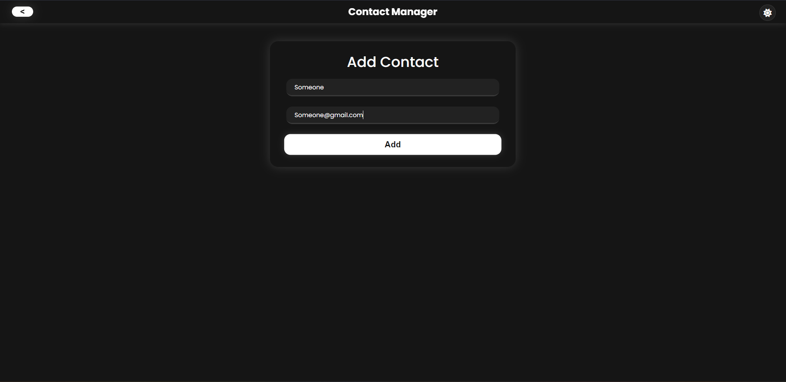
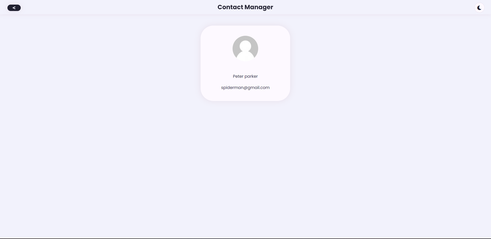
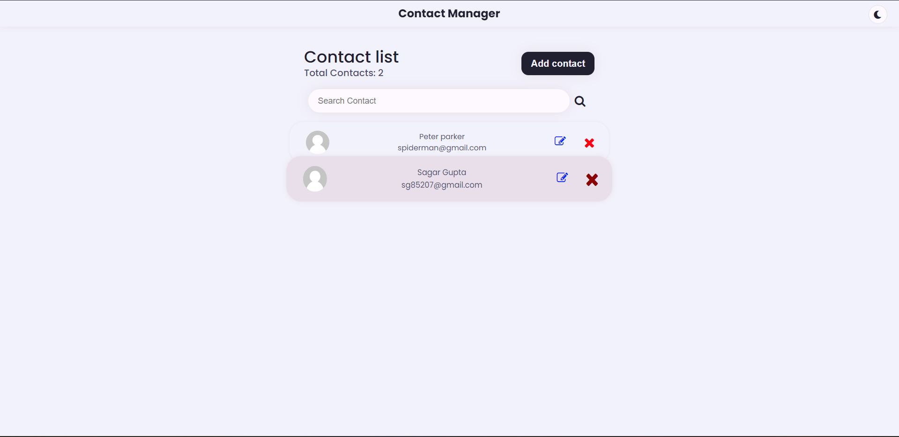

## Project Images

**Contact Management Web Application - MERN Stack**

## Overview
This repository contains the code for a contact management web application built using the MERN (MongoDB, Express.js, React, Node.js) stack. The application includes features such as contact import, pagination, filtering, and contact download.

## Features
1. **Contact Listing:**
   - User-friendly interface displaying imported contacts.
   - Pagination for easy navigation (10 contacts per page).
   - Fields include contact name, phone number, email, and additional relevant information.

2. **Contact Import:**
   - Import contacts from both CSV and Excel files.
   - Validate file formats and display error messages for invalid files.
   - Trigger import process with a button or UI element.
  
3. **Contact Filtering:**
   - Intuitive filtering mechanism allowing users to apply multiple filters.
   - Filters include date of creation, name, phone number, country code, and more.
   - Instant feedback on filtered results.

4. **Contact Download:**
   - Select one or more contacts for download in Excel format.
   - User-friendly selection mechanism.
   - Trigger download process with a button or UI element.
